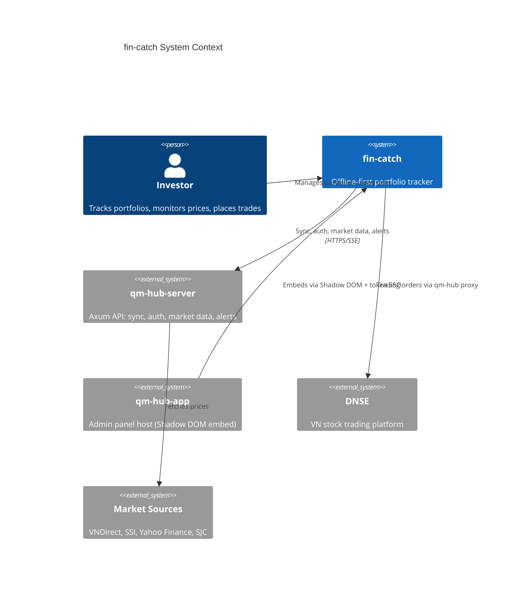
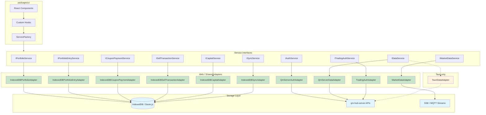
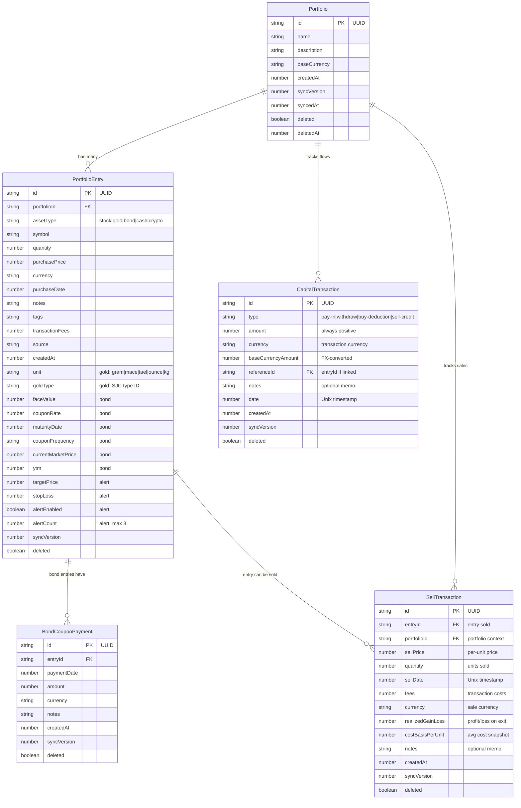
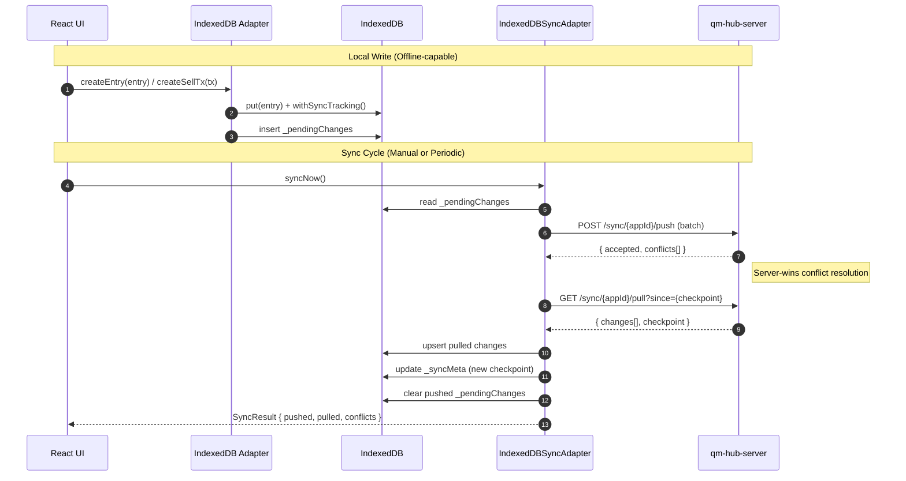
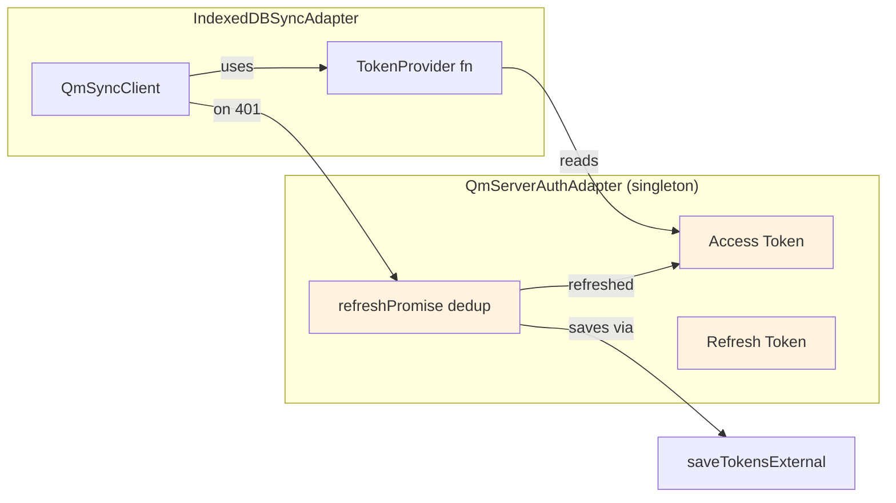
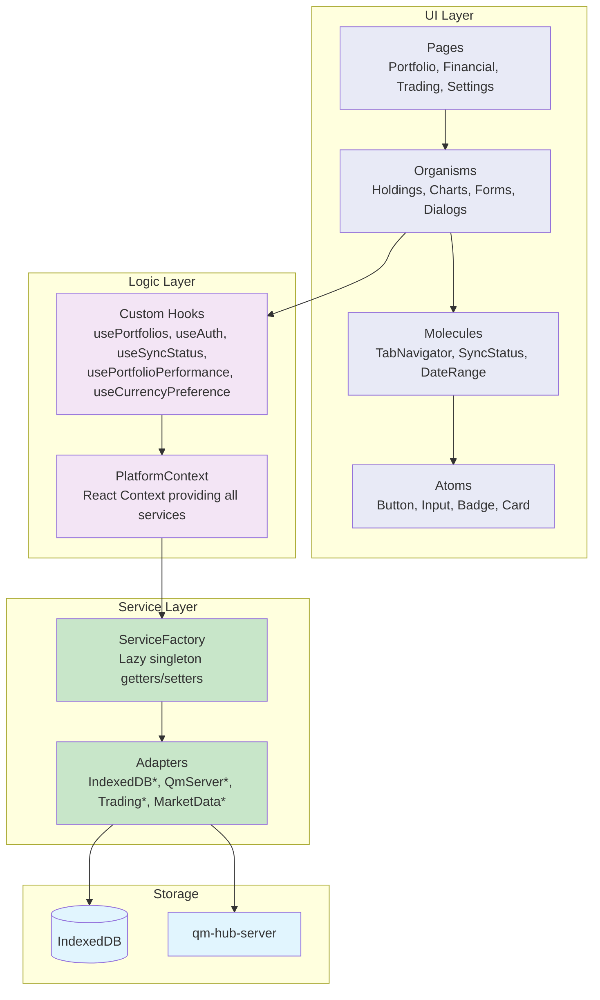
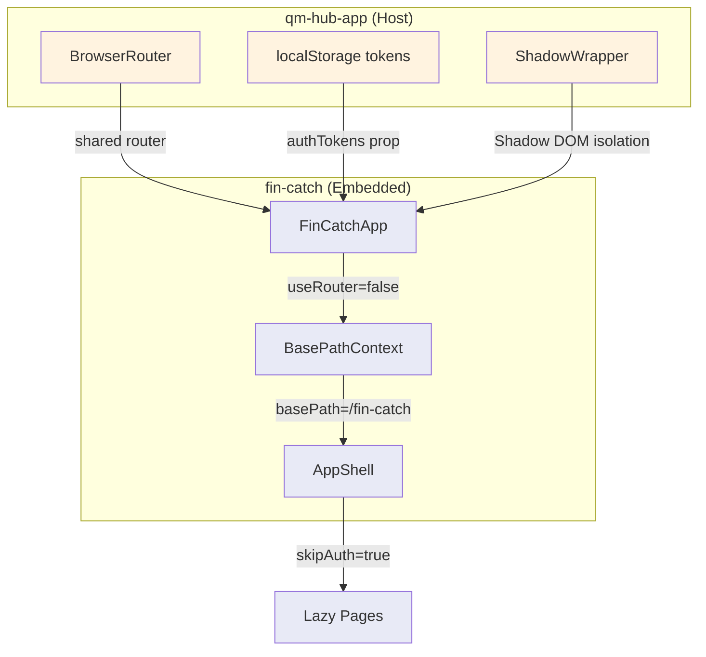
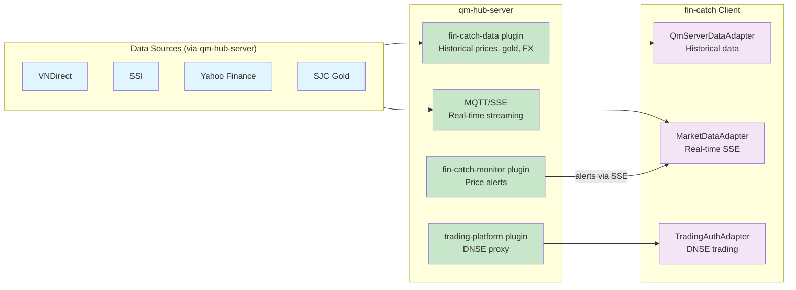
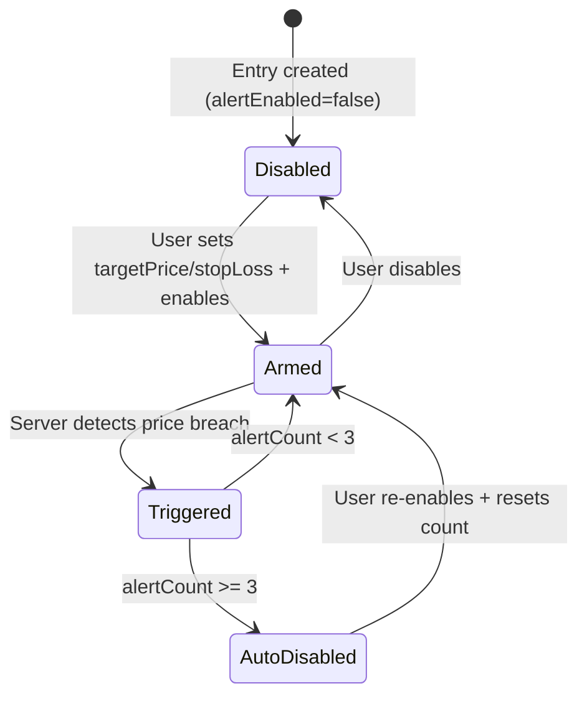

# fin-catch Architecture

## Overview

fin-catch is an offline-first portfolio tracker for Vietnamese financial markets (stocks, gold, bonds, crypto, cash). Built as an embeddable React app with platform-agnostic storage via IndexedDB/Dexie.js, it syncs to qm-hub-server using checkpoint-based pagination. Supports standalone (web/Tauri desktop) and embedded mode (inside qm-hub-app via Shadow DOM).



## Monorepo Structure

```
fin-catch/
├── apps/
│   ├── web/              # Vite SPA (port 25095)
│   └── native/           # Tauri v2 desktop
├── packages/
│   ├── shared/           # Types, constants (no React)
│   ├── ui/               # Components, hooks, adapters, stores
│   ├── tsconfig/         # Shared TS configs
│   └── eslint-config/    # Shared lint rules
├── turbo.json            # Turborepo task graph
└── fin-catch-app-schema.json  # Server sync table definitions
```

## Platform Adapter Architecture

All business logic lives in `packages/ui`. Platform differences are abstracted behind service interfaces, resolved at boot via `ServiceFactory`.



**Key decisions:**

1. **Unified storage:** Both web and Tauri use IndexedDB (Dexie.js) — no SQLite. Eliminates platform-specific storage bugs.
2. **Platform-specific data:** Only `IDataService` differs — Tauri uses native IPC for market data; web uses HTTP adapters.
3. **Sell transactions & capital tracking (Phase 01):** Realized gain/loss computed at exit time, capital flows tracked separately to enable capital growth analysis independent of market fluctuations.

## Domain Model



**Asset types:** `stock` (VN market symbols), `gold` (SJC bars/rings with unit conversion), `bond` (face value + coupon tracking + YTM), `cash` (currency holdings), `crypto` (placeholder).

**Capital transaction types:**
- `pay-in` — Deposit capital into portfolio
- `withdraw` — Withdraw capital from portfolio
- `buy-deduction` — Deduction for buy operation (settlement fee)
- `sell-credit` — Credit received from sell operation

### Computed Models

| Model | Purpose | Source |
|-------|---------|--------|
| `PortfolioPerformance` | Total value, cost, gain/loss (unrealized + realized), per-entry breakdown | Aggregated from entries + live prices + sell transactions |
| `EntryPerformance` | Current price, value, unrealized + realized gain/loss %, exchange rate | Single entry + market data + sell transactions |
| `CapitalSummary` | Net capital flow, available capital, total invested | Aggregated from capital transactions |
| `AssetAllocation` | Symbol, type, value, percentage | Portfolio-wide pie chart data |
| `HoldingPerformance` | Normalized curve (base 100 at purchase) | Historical price data |

## Sync Architecture

Offline-first with checkpoint-based pagination. Five synced tables defined in `fin-catch-app-schema.json`: `portfolios`, `portfolioEntries`, `bondCouponPayments`, `sellTransactions`, `capitalTransactions`.



### Sync Storage Schema (IndexedDB)

| Table | Purpose |
|-------|---------|
| `portfolios` | Domain data — portfolio metadata |
| `portfolioEntries` | Domain data — holdings (stock, gold, bond, etc.) |
| `bondCouponPayments` | Domain data — coupon income tracking |
| `sellTransactions` | Domain data — liquidity events + realized gain/loss (Phase 01) |
| `capitalTransactions` | Domain data — capital flows (deposits, withdrawals, fees) (Phase 01) |
| `_syncMeta` | Per-table `last_sync_timestamp` checkpoints |
| `_pendingChanges` | Queued local mutations (auto-increment ID, tableName, rowId, operation, data, version) |

**Dexie.js indexes** (v3 schema):
- `sellTransactions`: `id, entryId, portfolioId, sellDate, syncVersion, syncedAt, deleted`
- `capitalTransactions`: `id, type, date, referenceId, syncVersion, syncedAt, deleted`

### Conflict Resolution

- **Strategy:** Server-wins (default). `syncVersion` field on every record.
- **Soft delete:** `deleted=true` + `deletedAt` timestamp. Server purges after 60 days TTL.
- **Client UUIDs:** Records created offline with client-generated UUIDs — no ID collisions on sync.

### Auth Token Flow in Sync



Token refresh is deduplicated — concurrent 401s share a single refresh promise. Sync adapter skips retry on 401/403 (prevents auth lockout loops).

## Data Flow



## Routing & Embedding

### Route Map

| Path | Page | Auth Required |
|------|------|---------------|
| `/` | LoginPage | No |
| `/portfolio` | PortfolioPage | Yes |
| `/financial-data` | FinancialDataPage | Yes |
| `/settings` | SettingsPage | Yes |
| `/trading` | TradingPage | Yes |
| `/trading-operations` | TradingOperationsPage | Yes |

All pages lazy-loaded via `React.lazy()`.

### Embedded Mode



**Embed props:**
- `embedded=true` — hides Sidebar/BottomNav
- `useRouter=false` — shares parent's BrowserRouter
- `basePath="/fin-catch"` — prefixes all routes
- `authTokens` — SSO via parent's JWT tokens
- `onLogoutRequest` — delegates logout to parent

**Logout flow:** Parent dispatches `window.dispatchEvent(new Event('auth:logout'))` → fin-catch hooks clear local state → re-mount with login screen.

## Market Data & Trading



### Price Alert Lifecycle



Alerts stored on `PortfolioEntry` fields. Server-side `qm-fin-catch-monitor` polls prices, fires notifications via `qm-notification`, sends SSE events to client as toast notifications.

## Testing Strategy

| Layer | Tool | Pattern |
|-------|------|---------|
| Adapters | Vitest + jsdom | Mock fetch, test adapter logic in isolation |
| Sync | Vitest | Mock IndexedDB storage, test retry/backoff/conflict |
| Auth | Vitest | Mock HTTP, test token refresh dedup + race conditions |

```bash
pnpm test:run    # Single run (CI)
pnpm test        # Watch mode (dev)
```

Test files:
- `adapters/shared/QmServerAuthAdapter.test.ts`
- `adapters/web/sync/IndexedDBSyncAdapter.test.ts`
- `adapters/web/sync/IndexedDBSyncStorage.test.ts`

## Key Dependencies

| Package | Version | Purpose |
|---------|---------|---------|
| `dexie` | 4.3.0 | IndexedDB abstraction |
| `recharts` | 3.7.0 | Charts (candlestick, pie, line) |
| `react-hook-form` | 7.71.1 | Form state |
| `framer-motion` | 12.34.0 | Animations |
| `@radix-ui/*` | latest | Accessible UI primitives |
| `@tauri-apps/api` | 2.10.1 | Desktop IPC |
| `@qm-hub/sync-client-types` | 0.2.2 | Sync protocol types |
| `tailwindcss` | 4.1.18 | Styling (v4 + Vite plugin) |

## Build & Deploy

```bash
pnpm dev:web       # Dev server (port 25095)
pnpm dev:tauri     # Tauri desktop dev
pnpm build         # Production build (all workspaces)
pnpm lint          # ESLint
pnpm format        # Prettier
```

Web build outputs to `apps/web/dist/`. Tauri produces native bundles per platform.
